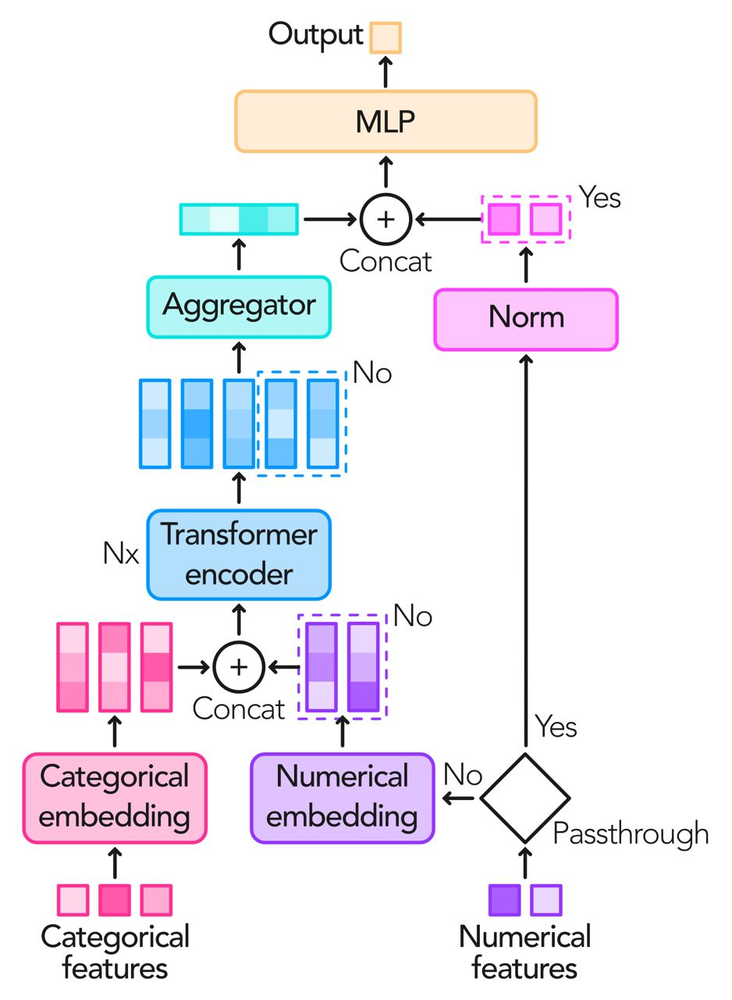

# Tabular Transformer

This repository contains the architecture described in the research of Transformers for high-dimensional tabular data. For experiments code described in the article visit https://github.com/cobu93/transformer-tabular-data.




## Installation guide

### Installing from PyPi

By running the next line you will install it from PyPi repo:

```
pip install ndsl-attn-fs-archs 
```

### Installing from source

The first step is to download or clone this repository. Once done, go to the folder containing the surce code and build the package by executing

```
make
```

or

```
make build
```

When the bulding is complete, install the package by running

```
make install
```

## Usage

Here we include a snippet containing a basic example of the usage 

```
from ndsl.architecture.attention import TabularTransformer

...

n_categories=5 # Integer
n_numerical=5 # Integer
n_head=8 #Integer
n_hid=256 # Integer
n_layers=2 # Integer
n_output=1 # Integer
embed_dim=256 # Integer
attn_dropout=0.1 # Float between [0, 1]
ff_dropout=0.1 # Float between [0, 1]
aggregator="rnn" # One of {concatenate, cls, max, mean, sum, rnn} as string
rnn_cell="GRU" # One of {GRU, LSTM} as string
rnn_output_size=128 # Integer
rnn_n_layers=3 # Integer
rnn_dropout=0.1 # Float between [0, 1]
        
decoder_hidden_units=[128, 64] # List of integers
decoder_activation_fn=nn.ReLU() # Torch activation function instance
need_weights=False # Boolean
numerical_passthrough=False # Boolean

...

module = TabularTransformer(
        n_categories, # Count of categorical features
        n_numerical, # Count of numerical features
        n_head, # Number of heads per layer
        n_hid, # Size of the MLP inside each transformer encoder layer
        n_layers, # Number of transformer encoder layers    
        n_output, # Number of outputs (classes)
        embed_dim=embed_dim, # Embedding size
        attn_dropout=attn_dropout, # Dropout used in MHSA mechanism
        ff_dropout=ff_dropout, # Dropout used for each MLP inside transformer encoder
        aggregator=aggregator, # Embeddings aggregation method
        rnn_aggregator_parameters={ # Just in case of RNN aggregator
            "cell": rnn_cell, # Cell used for RNN aggregator 
            "output_size": rnn_output_size, # Hidden size of RNN aggregator 
            "num_layers": rnn_n_layers, # Number of layersfor RNN aggregator
            "dropout": rnn_dropout # Dropout applied to RNN aggregator
        },
        decoder_hidden_units=decoder_hidden_units, # Hidden units of the output MLP
        decoder_activation_fn=decoder_activation_fn, # Output MLP activation function
        need_weights=need_weights, # True if attention cubes are required
        numerical_passthrough=numerical_passthrough # If numerical passthrough will be applied
    )
```

When __need_weights__ is set to _False_, for $N$ the batch size, the output will be of size $(N, n\_output)$, and when set to _True_ the output will be of 3-tuple containing tensors of sizes

- $(N, n\_output)$,
- $(n\_layers + 1, N, n\_features, embedding\_size)$, where the $+1$ in the first dimension means the inclusion of the original embeddings for each feature processed in the MHSA, and $n\_features$ is the number of features processed by the MHSA mechanism deppending on the _numerical_passthrough_ value, and
- $(n\_layers, N, n\_head, n\_features, n\_features)$ including the attention cubes for each encoder layer.

